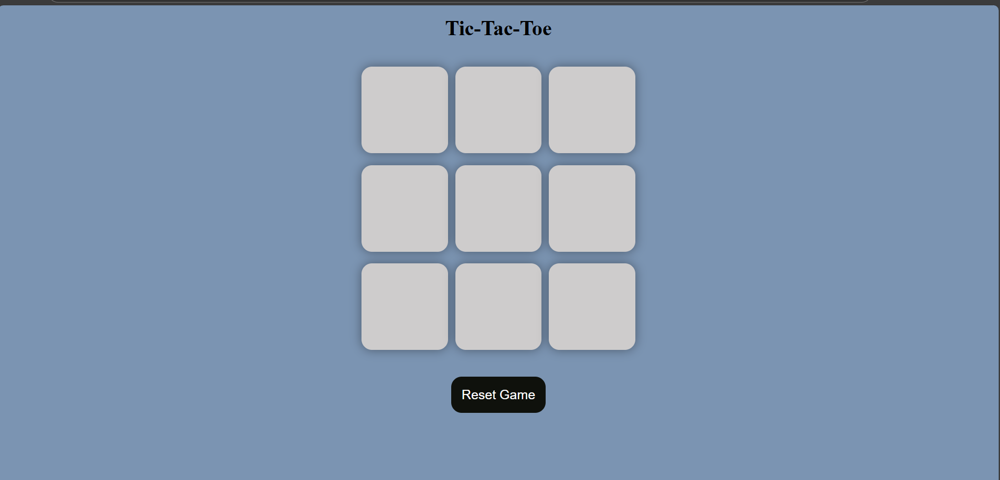

# 🎮 Tic-Tac-Toe Game

A simple yet elegant Tic-Tac-Toe game built using **HTML**, **CSS**, and **JavaScript**. This project focuses on clean UI, responsive layout, and intuitive game logic—perfect for casual play or showcasing your frontend skills.

## 🚀 Features

- Two-player turn-based gameplay (X vs O)
- Win detection using predefined patterns
- Draw detection when all boxes are filled
- Reset and New Game buttons for replayability
- Dynamic styling for player moves
- Responsive design using `vmin` units

## 🧠 How It Works

- The game board is a 3×3 grid of buttons.
- Players alternate turns, starting with "X".
- After each move, the game checks for a win or draw.
- If a win is detected, a congratulatory message is shown.
- If all boxes are filled without a winner, it's a draw.
- Players can reset or start a new game anytime.

## 📁 File Structure

```plaintext
├── index.html       # Game layout and structure
├── style.css        # Styling and responsive design
└── app.js           # Game logic and interactivity
```

## 🎨 Design Highlights

- **Soft color palette** for a calming visual experience
- **Contrast styling** for player moves (X and O) to stand out
- **Box shadows** and hover effects for depth and interactivity
- **Responsive layout** using `vmin` units for consistent scaling
- **Status message container** to display game results clearly
- **Minimalist button design** for clean, tactile gameplay

## 🛠️ Tech Stack

- **HTML5**
- **CSS3** (Flexbox, responsive units)
- **Vanilla JavaScript** (DOM manipulation, event handling)

---

## 📸 Preview



---

## ✨ Future Improvements

- Add score tracking across rounds  
- Include sound effects for moves and wins  
- Implement AI for single-player mode  
- Animate winning line

---

## 🙋‍♀️ About Me

Hi! I'm **Anushka** 👩‍💻 — a passionate web developer exploring how HTML, CSS, and JavaScript interact to build real-world projects. I love debugging, learning new workflows, and making clean, functional interfaces.

Feel free to **fork**, **clone**, or **customize** this project. Contributions and feedback are welcome!
